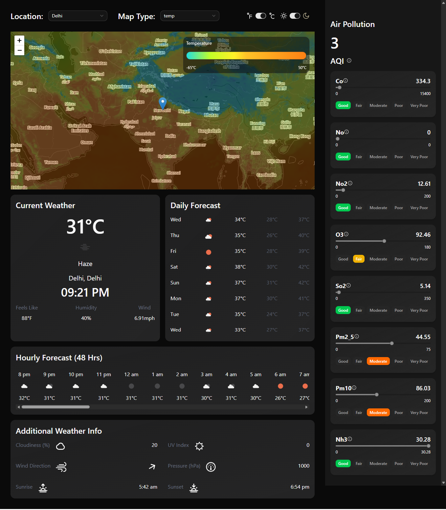

# rc-weather-map

A weather visualization app built on top of a map, with a focus on clean architecture and reliable data handling.

---

## Overview

rc-weather-map is a frontend project that combines real-time weather data with interactive maps. It's built with the kind of structure you'd want if the codebase needed to grow — clear separation of concerns, typed data all the way through, and async state handled properly.

Live URL: https://openaero.netlify.app/
Preview: 

---

## Architecture

The project is organized around features rather than file types:

features/
weather/
map/
location/

Each feature owns its UI, hooks, API calls, and validation. This keeps things from getting tangled as the project scales.

Server state (API data) is kept separate from local UI state, managed through React Query's caching and background refetch. This avoids redundant requests and keeps the UI consistent.

All API responses are validated at runtime with Zod before anything reaches the UI.

---

## Tech Stack

- **React 19 (RC)** + **TypeScript** + **Vite**
- **TanStack React Query** — async state and caching
- **Zod** — runtime validation
- **Leaflet** + **React Leaflet** — maps
- **MapTiler SDK** — tile rendering
- **TailwindCSS v4** + **shadcn/ui** + **Radix** — UI components
- **Lucide** — icons

---

## Data Flow

User Interaction → Component → Custom Hook → React Query → API → Zod → UI

---

## Local Development

```bash
git clone https://github.com/your-username/rc-weather-map.git
cd rc-weather-map
npm install
npm run dev
```

## Environment Variables

VITE_MAPTILER_API_KEY
VITE_WEATHER_API_KEY

## License

MIT
